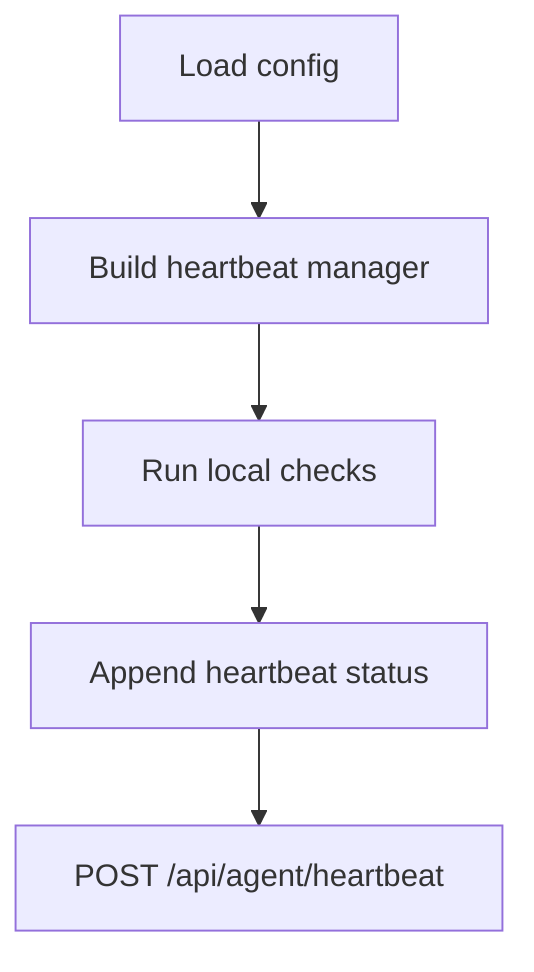
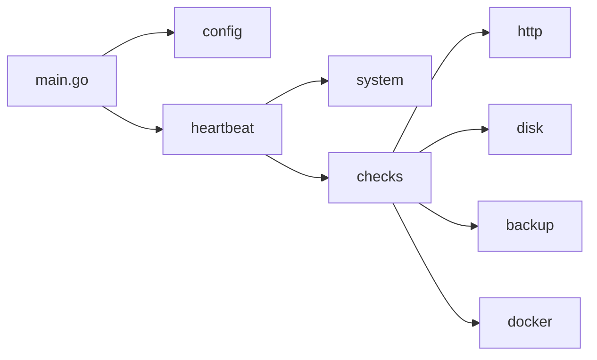
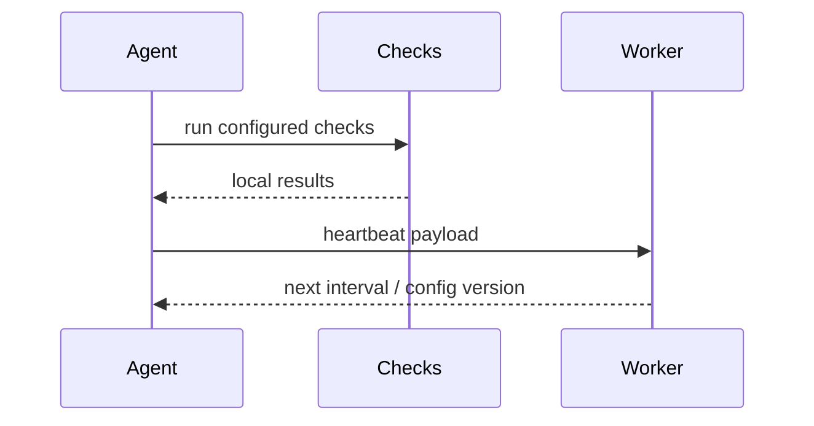

# Go Agent

## Overview

This module is the lightweight local agent that runs inside the user's network. It executes local checks, gathers machine metadata, and sends outbound heartbeats to the Cloudflare Worker.

## Key Components

- Entry point: [cmd/clawping-agent/main.go](/Volumes/SSD/clawping/clawping/agent/cmd/clawping-agent/main.go)
- Config loader: [internal/config/config.go](/Volumes/SSD/clawping/clawping/agent/internal/config/config.go)
- Heartbeat manager: [internal/heartbeat/heartbeat.go](/Volumes/SSD/clawping/clawping/agent/internal/heartbeat/heartbeat.go)
- HTTP check: [internal/checks/http_check.go](/Volumes/SSD/clawping/clawping/agent/internal/checks/http_check.go)
- Disk check: [internal/checks/disk_check.go](/Volumes/SSD/clawping/clawping/agent/internal/checks/disk_check.go)
- Backup freshness check: [internal/checks/backup_check.go](/Volumes/SSD/clawping/clawping/agent/internal/checks/backup_check.go)
- Docker container check: [internal/checks/docker_check.go](/Volumes/SSD/clawping/clawping/agent/internal/checks/docker_check.go)
- System info provider: [internal/system/system.go](/Volumes/SSD/clawping/clawping/agent/internal/system/system.go)

## Diagrams

### Flowchart

### Component Diagram

### Sequence Diagram

