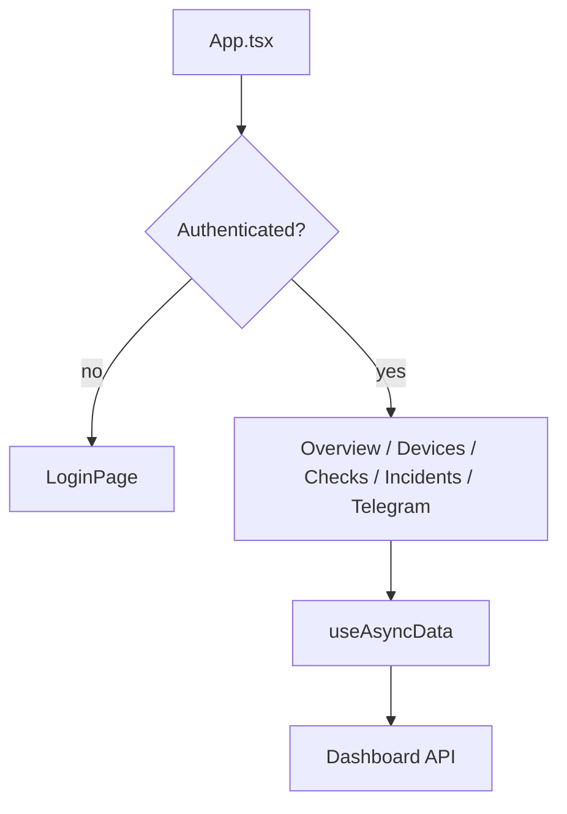
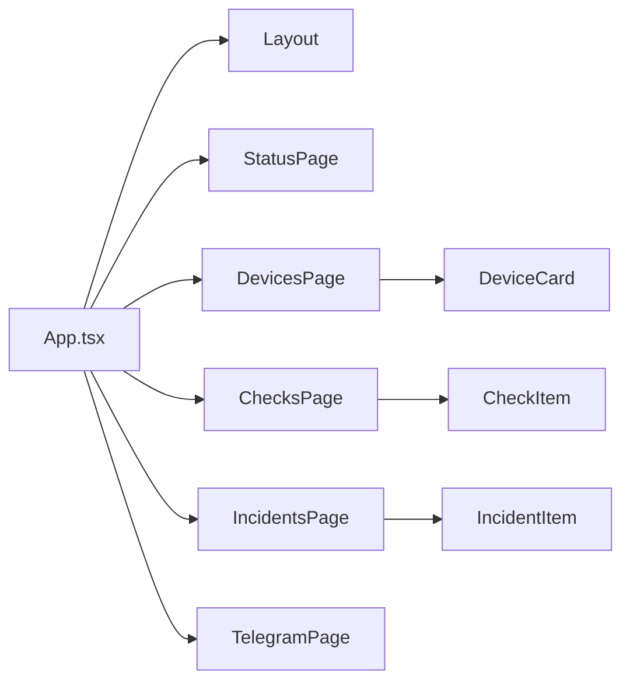
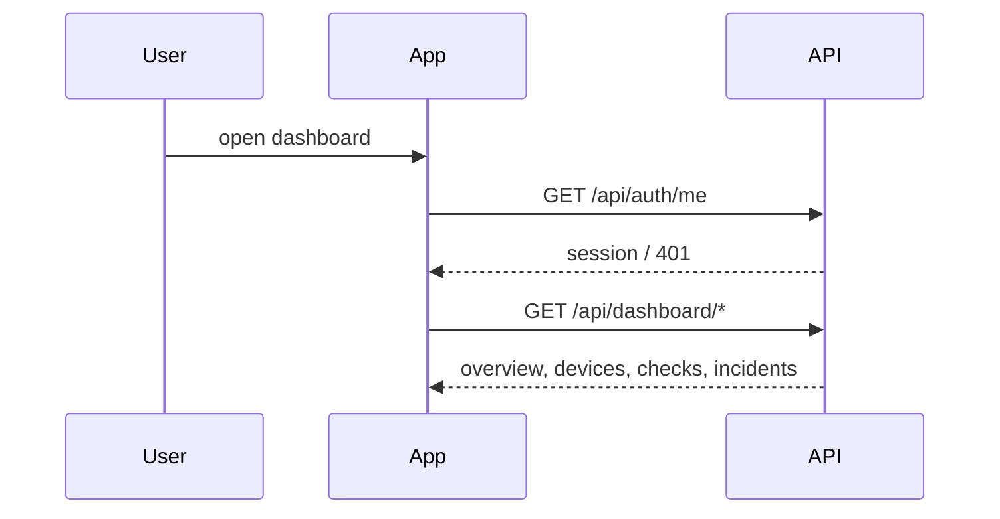

# Dashboard App

## Overview

This module is the React SPA for onboarding, configuration, and debugging. Telegram is the daily product surface; the dashboard is the setup and operational control surface.

## Key Components

- App shell and navigation: [src/App.tsx](/Volumes/SSD/clawping/clawping/apps/dashboard/src/App.tsx)
- Layout: [src/components/Layout.tsx](/Volumes/SSD/clawping/clawping/apps/dashboard/src/components/Layout.tsx)
- Status page: [src/pages/StatusPage.tsx](/Volumes/SSD/clawping/clawping/apps/dashboard/src/pages/StatusPage.tsx)
- Devices page: [src/pages/DevicesPage.tsx](/Volumes/SSD/clawping/clawping/apps/dashboard/src/pages/DevicesPage.tsx)
- Checks page: [src/pages/ChecksPage.tsx](/Volumes/SSD/clawping/clawping/apps/dashboard/src/pages/ChecksPage.tsx)
- Incidents page: [src/pages/IncidentsPage.tsx](/Volumes/SSD/clawping/clawping/apps/dashboard/src/pages/IncidentsPage.tsx)
- Telegram setup page: [src/pages/TelegramPage.tsx](/Volumes/SSD/clawping/clawping/apps/dashboard/src/pages/TelegramPage.tsx)
- Auth hook: [src/hooks/useAuth.ts](/Volumes/SSD/clawping/clawping/apps/dashboard/src/hooks/useAuth.ts)
- Async data hook: [src/hooks/useApi.ts](/Volumes/SSD/clawping/clawping/apps/dashboard/src/hooks/useApi.ts)
- HTTP client helpers: [src/lib/api.ts](/Volumes/SSD/clawping/clawping/apps/dashboard/src/lib/api.ts)

## Diagrams

### Flowchart

### Component Diagram

### Sequence Diagram

