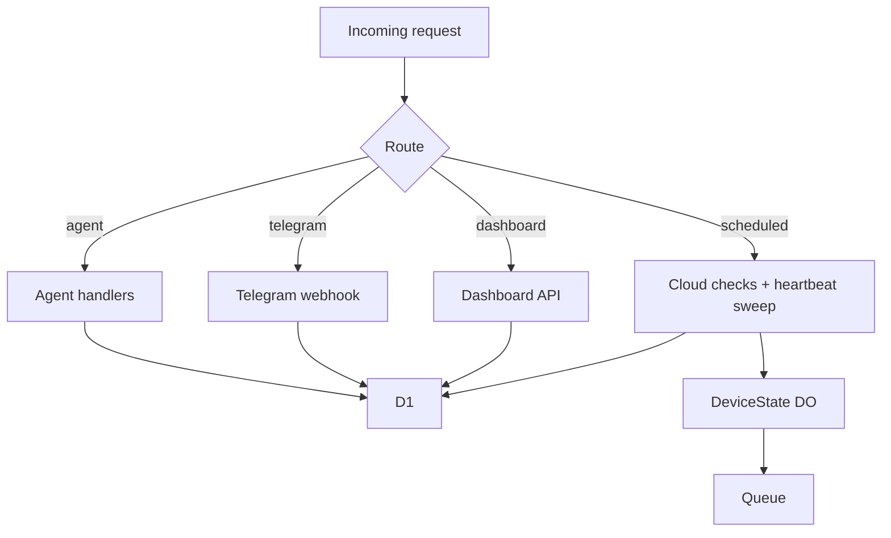
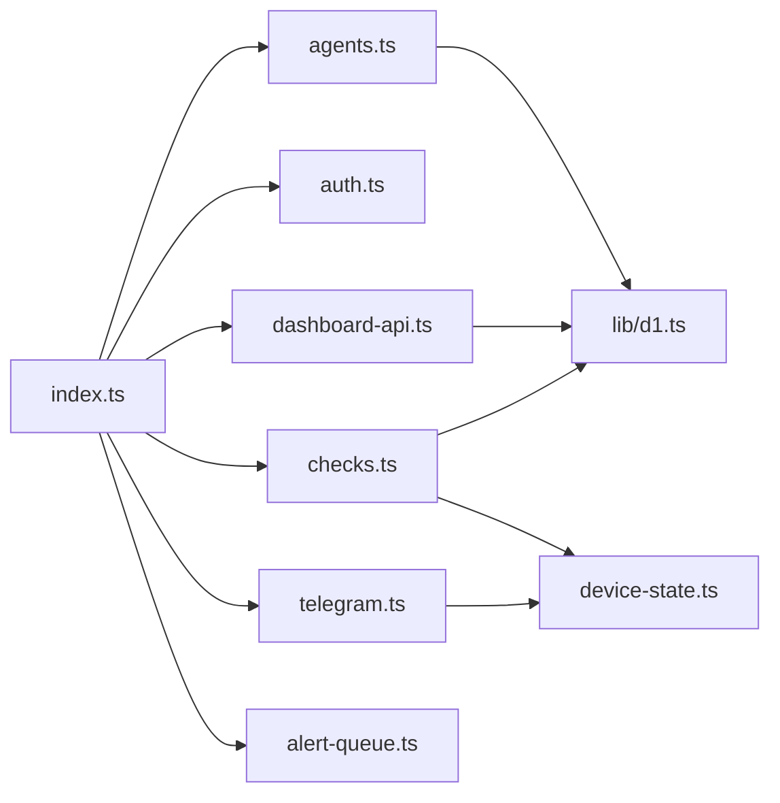
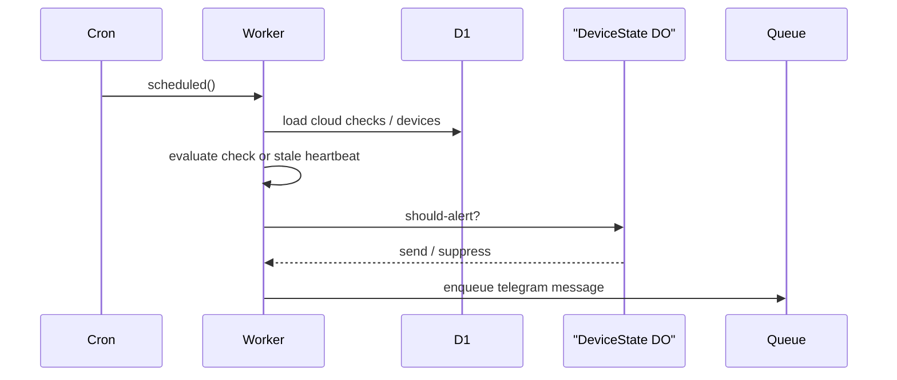

# Worker Control Plane

## Overview

This module is the Cloudflare Worker control plane. It owns the public API, Telegram webhook, dashboard API, scheduled checks, missed-heartbeat sweeps, D1 persistence, Queue fanout, and Durable Object alert deduplication.

## Key Components

- Entry point: [src/index.ts](/Volumes/SSD/clawping/clawping/apps/worker/src/index.ts)
- Agent routes: [src/routes/agents.ts](/Volumes/SSD/clawping/clawping/apps/worker/src/routes/agents.ts)
- Auth routes: [src/routes/auth.ts](/Volumes/SSD/clawping/clawping/apps/worker/src/routes/auth.ts)
- Dashboard API: [src/routes/dashboard-api.ts](/Volumes/SSD/clawping/clawping/apps/worker/src/routes/dashboard-api.ts)
- Scheduled checks: [src/routes/checks.ts](/Volumes/SSD/clawping/clawping/apps/worker/src/routes/checks.ts)
- Telegram webhook: [src/routes/telegram.ts](/Volumes/SSD/clawping/clawping/apps/worker/src/routes/telegram.ts)
- D1 helpers: [src/lib/d1.ts](/Volumes/SSD/clawping/clawping/apps/worker/src/lib/d1.ts)
- Cloud checks: [src/monitor.ts](/Volumes/SSD/clawping/clawping/apps/worker/src/monitor.ts)
- Durable Object: [src/durable-objects/device-state.ts](/Volumes/SSD/clawping/clawping/apps/worker/src/durable-objects/device-state.ts)
- Queue consumer: [src/queues/alert-queue.ts](/Volumes/SSD/clawping/clawping/apps/worker/src/queues/alert-queue.ts)
- D1 migration: [migrations/0001_init.sql](/Volumes/SSD/clawping/clawping/apps/worker/migrations/0001_init.sql)

## Diagrams

### Flowchart

### Component Diagram

### Sequence Diagram

