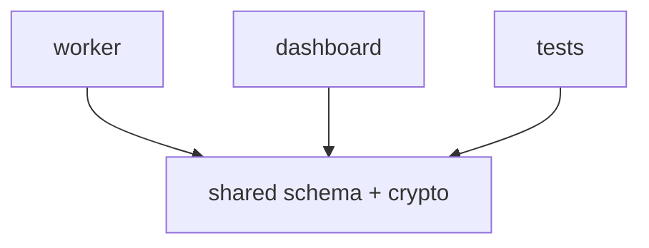
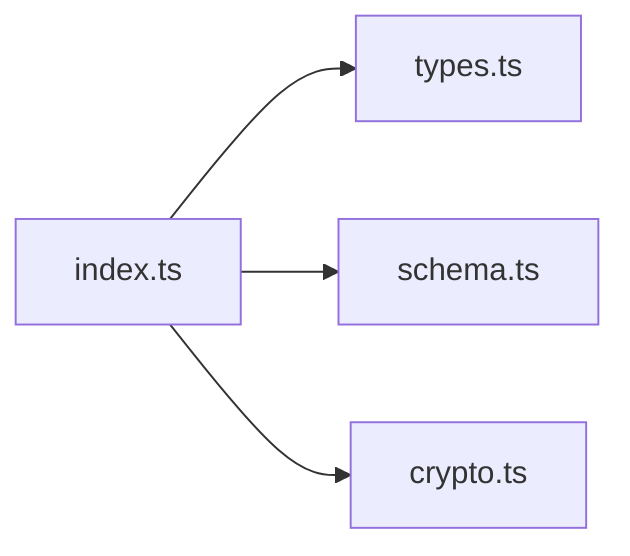
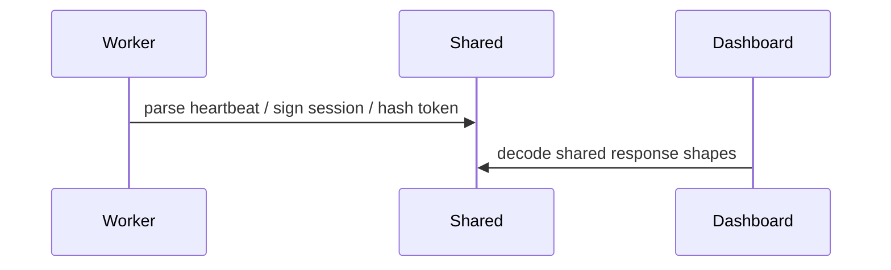

# Shared Package

## Overview

This package contains shared types, schema validation, session signing, and token hashing used by both the worker and the dashboard.

## Key Components

- Public export barrel: [src/index.ts](/Volumes/SSD/clawping/clawping/packages/shared/src/index.ts)
- Shared types: [src/types.ts](/Volumes/SSD/clawping/clawping/packages/shared/src/types.ts)
- Schema validation helpers: [src/schema.ts](/Volumes/SSD/clawping/clawping/packages/shared/src/schema.ts)
- Crypto helpers: [src/crypto.ts](/Volumes/SSD/clawping/clawping/packages/shared/src/crypto.ts)

## Diagrams

### Flowchart

### Component Diagram

### Sequence Diagram

